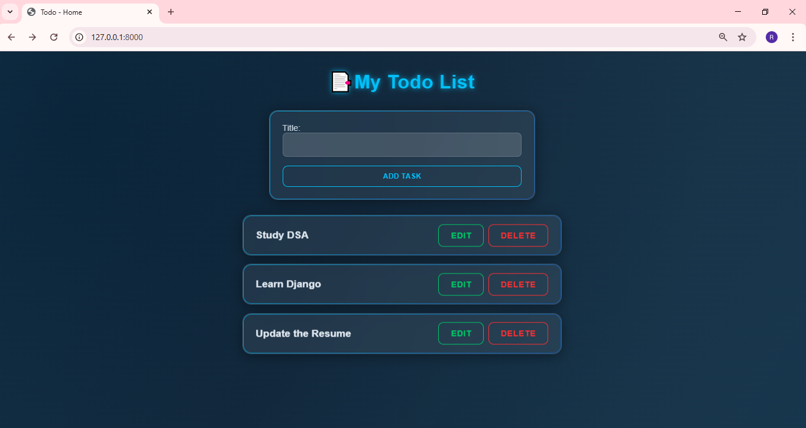
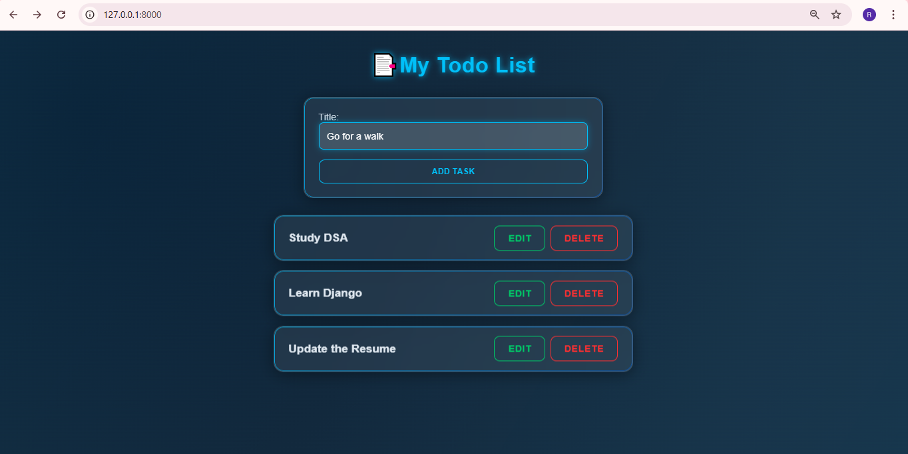
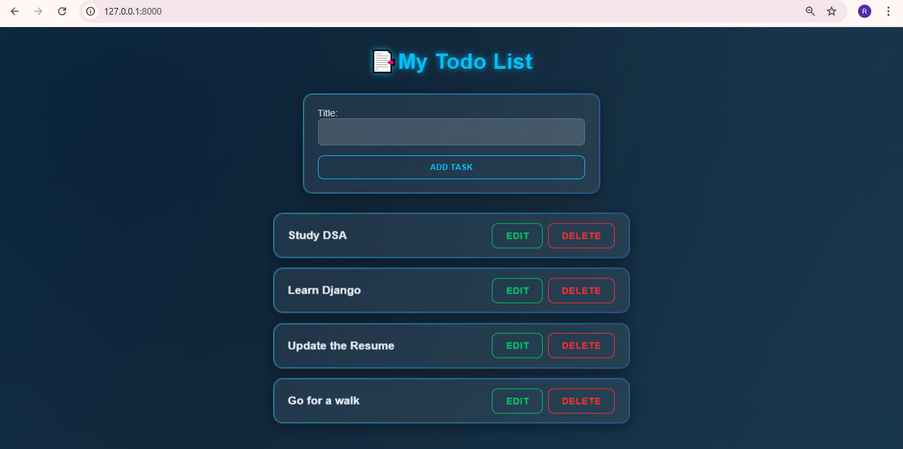
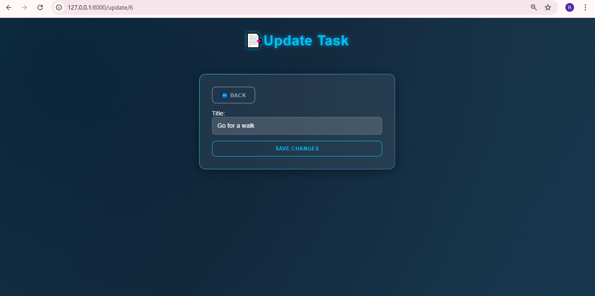
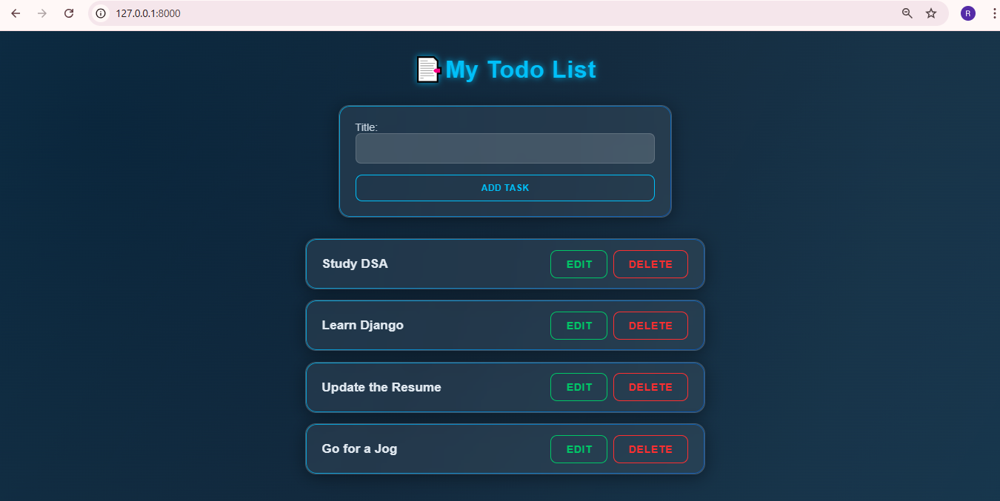
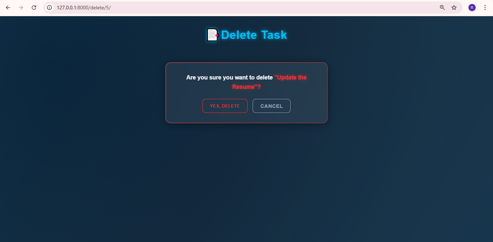
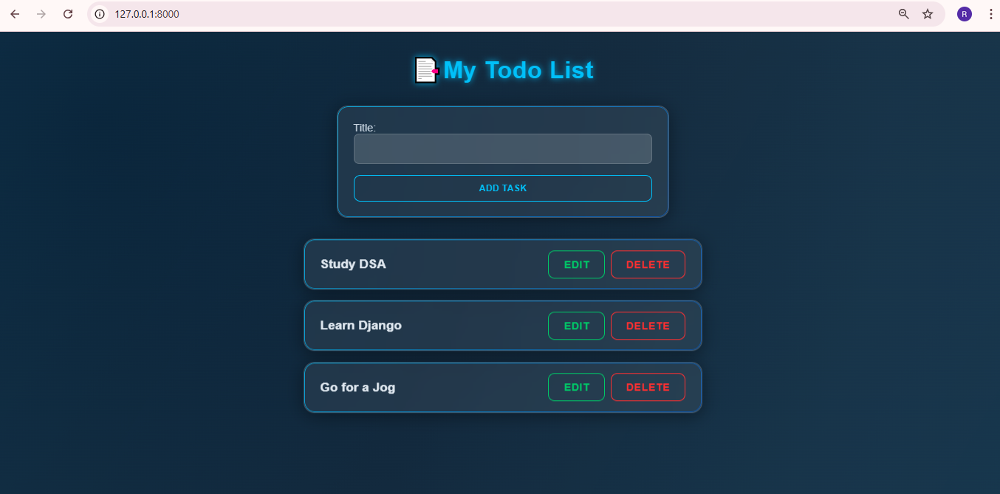

# To-Do-App
This To-Do application is built using **Django, HTML, CSS, and JavaScript**.  

- It allows users to manage tasks by performing **CRUD operations** such as **creating, viewing, updating, and deleting tasks**.  
- The project demonstrates **basic web development concepts** and **Django backend functionality**.

## Table of Contents 
- [Prerequisites](#prerequisites)
- [Installation](#installation)
- [Run the application](#run-the-application)
- [Run the tests](#run-the-tests)
- [View the application](#view-the-application)


## Prerequisites

Install the following prerequisites:

1. [Python 3.8-3.11](https://www.python.org/downloads/)
<br> This project uses **Django v6.0.3**. For Django to work, you must install a correct version of Python on your machine.
2. [Visual Studio Code](https://code.visualstudio.com/download)

## Installation

### 1. Create a virtual environment

From the **root** directory, run:

```bash
python -m venv venv
```

### 2. Activate the virtual environment

From the **root** directory, run:

On macOS:

```bash
source venv/bin/activate
```

On Windows:

```bash
venv\scripts\activate
```

### 3. Install required dependencies

From the **root** directory, run:

```bash
pip install -r requirements.txt
```

### 4. Run migrations

From the **root** directory, run:

```bash
python manage.py makemigrations
```
```bash
python manage.py migrate
```

### 5. Create an admin user to access the Django Admin interface

From the **root** directory, run:

```bash
python manage.py createsuperuser
```

When prompted, enter a username, email, and password.

## Run the application

From the **root** directory, run:

```bash
python manage.py runserver
```

## Run the tests

From the **root** directory, run:

```bash
python manage.py test --pattern="tests.py"

```

## View the application

Go to http://127.0.0.1:8000/ to view the application.

### Add Task




### Update Task




### Delete Task





